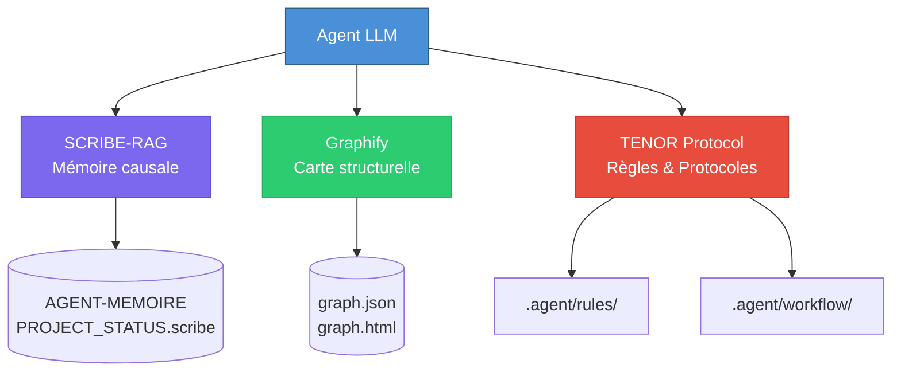

# 🧠 agent-scribe-graphify

**Bundle portable d'infrastructure agentique** — copiez `.agent/` dans n'importe quel projet et bénéficiez instantanément de SCRIBE, Graphify et du protocole TENOR.

> **Un seul dossier. Aucune dépendance externe. Aucune installation globale.**
> Fonctionne avec n'importe quel LLM hôte (OpenCode, Claude Code, Codex, Gemini...).

---

## ✨ Fonctionnalités

| Composant | Rôle |
|:----------|:-----|
| **SCRIBE** | Mémoire causale persistante — pourquoi les décisions ont été prises, les bugs déjà résolus, les patterns à suivre |
| **Graphify** | Carte structurelle du codebase — graphe AST en temps réel, navigation chirurgicale sans lire 50 fichiers |
| **TENOR** | Protocole de fiabilité — 8 règles absolues + 29 protocoles contextuels + self-audit |
| **RAG** | Retrieval-Augmented Generation — interrogez la mémoire projet en langage naturel via BM25 |
| **Multi-agent** | Coordination entre LLM : locks, claims, sync, worktrees |

---

## 🏗️ Architecture



### Responsabilités par couche

| Couche | Technologie | Fonction |
|:-------|:------------|:---------|
| **SCRIBE (SEL)** | Python, YAML | Écriture et maintenance de la mémoire causale |
| **SCRIBE-RAG** | BM25, FastAPI | Interrogation de la mémoire en langage naturel |
| **Graphify** | Python, AST | Analyse structurelle et visualisation du code |
| **TENOR** | YAML, Markdown | Règles, protocoles, auto-audit |

---

## 📦 Installation — Tutoriel complet

### Prérequis

- **Python 3.10+** avec `pip`
- **Git** (optionnel, pour versionner la mémoire)
- Aucune dépendance globale — tout est dans `.agent/`

### Étape 1 — Copier le bundle

```bash
# Depuis n'importe quel projet hôte :
cp -r /chemin/vers/agent-scribe-graphify/.agent/ /chemin/vers/mon-projet/
```

### Étape 2 — Initialiser le SCRIBE

```bash
cd /chemin/vers/mon-projet/
.agent/workflow/scribe/scribe bootstrap
```

> **⚠️ SÉCURITÉ** : `bootstrap` est **idempotent** — il ne fait que créer ce qui manque. Il ne démande aucun daemon et n'altère pas les fichiers existants.

### Étape 3 — Générer votre identité agent

```bash
.agent/workflow/scribe/scribe whoami --type cli --surface idle
```

Cette commande crée une identité unique pour votre session d'agent.

### Étape 4 — Initialisation complète (TENOR)

```bash
.agent/workflow/scribe/scribe tenor-init --type cli
```

Cette commande remplace les étapes 3 à 8 du protocole TENOR. Elle produit un `SCRIBE-CHECK TENOR V4 — MACHINE PROOF` qui prouve que tout est prêt.

### Étape 5 — Vérification

```bash
# Vérifier que le RAG fonctionne
.agent/workflow/scribe/scribe-rag gate

# Vérifier l'état de santé
.agent/workflow/scribe/scribe doctor

# Explorer le contexte mémoire
.agent/workflow/scribe/scribe-rag context
```

### Résultat attendu

```
gate  : 8/8 ✅
doctor: 0 error ✅
RAG   : BM25 indexé ✅
SCRIBE: prêt à recevoir votre mémoire causale ✅
```

---

## 🚀 Utilisation quotidienne

### Pour l'humain — une seule phrase

Dans votre interface agent (OpenCode, Codex CLI, Claude Code, Cursor, etc.),
tapez simplement cette phrase pour lancer l'initialisation complète :

```text
[TENOR INIT::[.agent/skills/init-tenor/SKILL.md]]
```

**C'est tout.** Le LLM hôte va :
1. Lire le fichier `SKILL.md` pour comprendre le protocole
2. Lancer `tenor-init --type cli` (ou `extension` selon votre interface)
3. Charger le SCRIBE, Graphify, et toutes les règles
4. Produire un `SCRIBE-CHECK TENOR V4 — MACHINE PROOF` pour prouver que tout est prêt
5. Attendre vos instructions d'implémentation

> **Une seule entrée utilisateur. Aucune commande manuelle. Tout est automatisé côté agent.**

#### Exemple de session

```
Vous : [TENOR INIT::[.agent/skills/init-tenor/SKILL.md]]
Agent : 📋 SCRIBE-CHECK TENOR V4 — MACHINE PROOF
        Agent session : cli-20260617-XXXX
        Whoami proof  : OK
        Workflow ack  : ACK_OK
        Status init   : VALID
        ✅ Prêt. Quelle est la prochaine tâche à implémenter ?

Vous : Ajoute une fonction de validation email dans le module auth
Agent : Je consulte le SCRIBE... Graphify analyse le codebase...
        [Travail en cours...]
        ✅ Implémentation terminée.
```

### Pour l'humain — Dashboard (optionnel)

Si vous voulez une interface web pour visualiser l'état du SCRIBE :

```bash
.agent/workflow/scribe/scribe dashboard
.agent/workflow/scribe/scribe dashboard --serve --host 127.0.0.1 --port 8765
```

---

## 🔄 Portabilité — d'un projet à l'autre

Le dossier `.agent/` est **totalement portable** :

```bash
# Projet A → Projet B
cp -r .agent/ /nouveau/projet/

# Dans le nouveau projet :
cd /nouveau/projet/
.agent/workflow/scribe/scribe bootstrap
.agent/workflow/scribe/scribe-rag build
```

> **Note** : La mémoire causale (`AGENT-MEMOIRE_PROJECT_STATUS.scribe`) est propre à chaque projet. Après copie, lancez `bootstrap` pour générer une mémoire vierge adaptée au nouveau contexte.

---

## ⚠️ Sécurité

| Risque | Solution |
|:-------|:---------|
| Email exposé dans le README | Remplacé par `your.email@example.com` |
| Username exposé | Remplacé par `USERNAME` |
| URLs hardcodées | Rendu générique — adaptez à votre contexte |
| Secrets dans le code | Variables d'environnement uniquement |
| Commandes push | Préfixées par `git add` par chemins exacts, jamais `git add .` |

> **⚠️ SÉCURITÉ** : Les commandes `git config user.name` / `git config user.email` sont **locales uniquement**. Remplacez `YOUR_NAME` et `your.email@example.com` par vos informations réelles **avant exécution**. Ne committez jamais le dossier `.agent/` entier — utilisez des chemins exacts.

---

## 📄 Licence

Distribué sous licence **MIT**. Utilisation libre, modification autorisée, attribution requise.

---

## 🙏 Crédits

- **SEL** — Moteur interne SCRIBE (Python, YAML)
- **SCRIBE-RAG** — Interface de retrieval BM25 + FastAPI
- **Graphify** — Analyse AST et visualisation de codebase

---

> Construit avec rigueur pour les équipes qui veulent que leurs LLMs aient de la mémoire.
