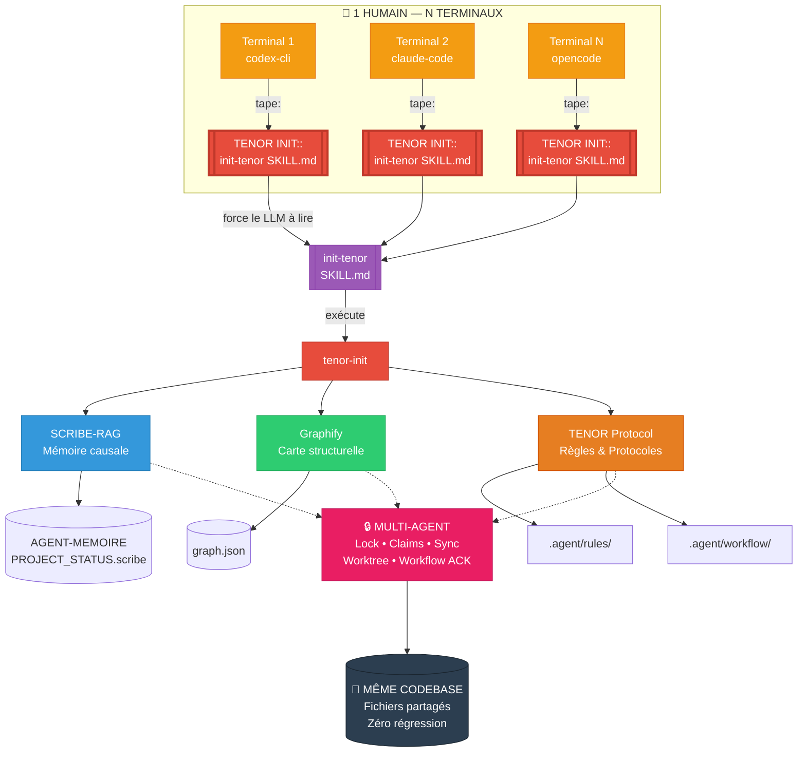

# 🧠 agent-scribe-graphify

**Bundle portable d'infrastructure agentique** — copiez `.agent/` dans n'importe quel projet et bénéficiez instantanément de SCRIBE, Graphify et du protocole TENOR.

> **Un seul dossier. Aucune dépendance externe. Aucune installation globale.**
> Fonctionne avec n'importe quel LLM hôte (OpenCode, Claude Code, Codex, Gemini...).

---

## ✨ Fonctionnalités

| Composant | Rôle |
|:----------|:-----|
| **SCRIBE** | Mémoire causale persistante — pourquoi les décisions ont été prises, les bugs déjà résolus, les patterns à suivre |
| **Graphify** | Carte structurelle du codebase — graphe AST en temps réel, navigation chirurgicale sans lire 50 fichiers |
| **TENOR** | Protocole de fiabilité — 8 règles absolues + 29 protocoles contextuels + self-audit |
| **RAG** | Retrieval-Augmented Generation — interrogez la mémoire projet en langage naturel via BM25 |
| **Multi-agent** | Coordination entre LLM : locks, claims, sync, worktrees |

---

## 🏗️ Architecture

### Arborescence du bundle `.agent/`

```text
.agent/
├── skills/
│   ├── init-tenor/        ← 🔑 PORTE D'ENTRÉE — le SKILL.md que le LLM lit
│   │   └── SKILL.md           au premier appel [TENOR INIT::...]
│   ├── graphify/           ← Compétences Graphify pour l'agent
│   │   └── SKILL.md
│   └── fallow/             ← Compétences auxiliaires
│       └── SKILL.md
│
├── rules/
│   ├── scribe.md           ← Règle always-on : SCRIBE obligatoire
│   └── graphify.md         ← Règle always-on : Graphify avant grepping
│
├── workflow/
│   ├── scribe/             ← 🔧 MOTEUR PRINCIPAL
│   │   ├── scribe          ← CLI maintenance interne (bootstrap, doctor, lock...)
│   │   ├── scribe-rag      ← CLI lecture agent (query, explain, challenge...)
│   │   ├── hooks/          ← Git hooks pré-commit
│   │   ├── sel/            ← Moteur SEL (Python) — documentation, scripts, tests
│   │   ├── rag/            ← Interface RAG BM25 + tests
│   │   └── sel/docs/       ← Documentation protocole complet
│   ├── mcp/
│   │   └── chrome-devtools.md ← Tests navigateur/visuel (MCP)
│   ├── prd/                ← Product Requirements Document
│   └── graphify.md         ← Workflow Graphify
│
└── scripts/                ← Scripts d'automatisation (bootstrap, watch, health)
```

### Diagramme d'ensemble



### Responsabilités des composants

| Composant | Technologie | Rôle |
|:----------|:------------|:-----|
| **init-tenor** | Markdown (SKILL.md) | 🔑 **Porte d'entrée** — lu en premier par le LLM sur `[TENOR INIT::...]`, déclenche toute l'initialisation |
| **TENOR Protocol** | YAML, Markdown | 8 règles absolues + 29 protocoles contextuels + self-audit + auto-mutation |
| **SCRIBE (SEL)** | Python, YAML | Moteur de mémoire causale : bootstrap, doctor, lock, whoami, workflow, coordination |
| **SCRIBE-RAG** | BM25, FastAPI | Interface de retrieval : query, explain, challenge, context, gate, eval |
| **Graphify** | Python, AST | Analyse structurelle temps réel : carte des dépendances, god-nodes, blast radius |
| **Rules** | Markdown | Règles always-on injectées à chaque réponse (`scribe.md`, `graphify.md`) |
| **MCP Chrome** | Markdown | Protocole de test navigateur/visuel (alternative à Playwright) |

### Cycle de vie complet — quand le LLM écrit ou lit quoi

```text
┌─ PHASE 1 — INITIALISATION (déclenchée par l'humain)
│
│  [TENOR INIT::[.agent/skills/init-tenor/SKILL.md]]
│     ↓
│  Le LLM lit init-tenor/SKILL.md, exécute tenor-init
│     ↓
│  bootstrap → whoami → workflow ack → lock → rag context
│     ↓
│  SCRIBE-CHECK TENOR V4 produit = session prête
│
├─ PHASE 2 — TÂCHE QUOTIDIENNE (humain donne des instructions)
│
│  Vous : "Ajoute une fonction de validation email"
│     ↓
│  Le LLM :
│     1. [CONSULTER] scribe-rag query "validation email déjà faite ?"
│     2. [CONSULTER] graphify query "module auth dépendances"
│     3. [ÉCRIRE]    Implémente le code
│     4. [ÉCRIRE]    Si bug > 2 tentatives → SCAR dans le SCRIBE
│     5. [ÉCRIRE]    Si nouveau pattern → PAT dans le SCRIBE
│
├─ PHASE 3 — CONDITIONS D'ÉCRITURE DANS LE SCRIBE
│
│  Le LLM écrit dans le SCRIBE UNIQUEMENT si :
│     ✅ Bug résolu après PLUS de 2 tentatives → SCAR obligatoire
│     ✅ Régression / rollback coûteux / smoke cassé → SCAR immédiat
│     ✅ Décision architecturale majeure prise → GHOST
│     ✅ Règle préventive identifiée (pour éviter une erreur) → VAC
│
│  Le LLM N'écrit PAS dans le SCRIBE si :
│     ❌ Petite correction routinière (1 tentative, pas de casse)
│     ❌ Aucun bug rencontré
│     ❌ Pour "gonfler" la documentation
│
├─ PHASE 4 — CONDITIONS DE LECTURE / REQUÊTE
│
│  Le LLM CONSULTE le SCRIBE (scribe-rag) :
│     🔍 Avant chaque implémentation → "est-ce que ça a déjà été fait ?"
│     🔍 Avant de modifier un module → "y a-t-il des cicatrices connues ?"
│     🔍 En cas de blocage → "quelles erreurs ont déjà été faites ici ?"
│
│  Le LLM CONSULTE Graphify :
│     🔍 Avant de lire un fichier → "montre-moi la structure"
│     🔍 Avant de modifier → "quel est le blast radius ?"
│     🔍 Pour trouver les dépendances → "qui importe quoi ?"
│
└─ PHASE 5 — FIN DE SESSION
     Le LLM écrit dans le journal de session
     Met à jour les métriques (SCARs, VACs, PATs)
     Propose des mutations de protocole si pertinent
```

---

## 👥 Mode Multi-Agent — plusieurs LLMs, même codebase

Une fonctionnalité clé du bundle : lancer **1, 3, 5 terminaux ou plus** simultanément, chacun avec son propre agent (Codex CLI, Claude Code, OpenCode...), et les faire travailler sur **le même projet, les mêmes fichiers, sans rien casser**.

### Comment ça marche

```text
┌─ TERMINAL 1 ─┐    ┌─ TERMINAL 2 ─┐    ┌─ TERMINAL 3 ─┐
│  OpenCode     │    │  Claude Code  │    │  Codex CLI    │
│  Agent A      │    │  Agent B      │    │  Agent C      │
└──────┬───────┘    └──────┬───────┘    └──────┬───────┘
       │                   │                   │
       └───────────────────┬───────────────────┘
                          ▼
              ┌─────────────────────┐
              │   SCRIBE Lock       │
              │   Coordination      │
              │   Sync & Worktree   │
              └─────────────────────┘
                          │
                          ▼
              ┌─────────────────────┐
              │   MÊME CODEBASE     │
              │   Fichiers partagés │
              │   Zéro régression   │
              └─────────────────────┘
```

### Règles de coordination — chaque agent les respecte

| Situation | Comportement |
|:----------|:-------------|
| **Agent A** travaille sur `auth/login.ts` | Prend un **claim** sur `auth` → les autres agents évitent ce fichier |
| **Agent B** veut modifier `auth/login.ts` | Doit **attendre** ou demander un **rebase** via sync |
| **Agent A** et **Agent B** travaillent sur des fichiers différents | ✅ OK — claims différents, pas de conflit |
| **Agent C** veut écrire dans le SCRIBE | Doit d'abord avoir un **workflow ack** à jour, puis **lock acquire** |
| Avant de livrer | Chaque agent lance `scribe worktree --strict` pour vérifier l'absence de conflit |

### Workflow complet pour l'humain

**1. Ouvrez N terminaux**

```bash
# Terminal 1
cd /chemin/du/projet
# Lancez votre agent (OpenCode, Codex CLI, Claude Code...)

# Terminal 2 (identique)
cd /chemin/du/projet
# Lancez un second agent

# Terminal 3, 4, 5... idem
```

**2. Chaque agent s'initialise**

```text
Vous : [TENOR INIT::[.agent/skills/init-tenor/SKILL.md]]
Agent : 📋 SCRIBE-CHECK TENOR V4 — MACHINE PROOF
        Agent session : cli-20260617-A1
```

Chaque terminal reçoit un **ID unique** (A1, B2, C3...) généré par `scribe whoami`.

**3. Chaque agent prend un claim**

Avant de toucher un fichier, l'agent réserve sa zone :
```bash
.agent/workflow/scribe/scribe coordination claim --scope "auth" --agent "cli-20260617-A1"
```

**4. Synchronisation avant livraison**

```bash
.agent/workflow/scribe/scribe sync --agent "cli-20260617-A1" --type cli
.agent/workflow/scribe/scribe worktree --strict
```

**5. Résultat — zéro conflit, zéro régression**

Les agents :
- **Ne s'écrasent pas** les fichiers mutuellement (claims + locks)
- **Lisert le SCRIBE** avant chaque modification (mémoire des erreurs passées)
- **Consultent Graphify** avant de lire des fichiers (blast radius connu)
- **Synchronisent** avant de livrer (worktree detecte les conflits)

### Pourquoi ça ne casse jamais

| Mécanisme | Protection |
|:----------|:-----------|
| **Claims** | Chaque agent déclare sa zone de travail → les autres savent où il opère |
| **Lock** | Verrouille le SCRIBE pendant une écriture → pas d'écrasement mémoire |
| **Sync** | Synchronise l'état avant chaque action → personne ne travaille sur un état périmé |
| **Worktree** | Vérifie les conflits avant livraison → pas de régression silencieuse |
| **Workflow ACK** | Un agent sans ack frais ne peut pas écrire dans le SCRIBE |
| **Graphify** | Voir le blast radius avant de modifier → éviter les cassures en chaîne |

---

## 📦 Installation — Tutoriel complet

### Prérequis

- **Python 3.10+** avec `pip`
- **Git** (optionnel, pour versionner la mémoire)
- Aucune dépendance globale — tout est dans `.agent/`

### Étape 1 — Copier le bundle

```bash
# Depuis n'importe quel projet hôte :
cp -r /chemin/vers/agent-scribe-graphify/.agent/ /chemin/vers/mon-projet/
```

### Étape 2 — Initialiser le SCRIBE

```bash
cd /chemin/vers/mon-projet/
.agent/workflow/scribe/scribe bootstrap
```

> **⚠️ SÉCURITÉ** : `bootstrap` est **idempotent** — il ne fait que créer ce qui manque. Il ne démande aucun daemon et n'altère pas les fichiers existants.

### Étape 3 — Générer votre identité agent

```bash
.agent/workflow/scribe/scribe whoami --type cli --surface idle
```

Cette commande crée une identité unique pour votre session d'agent.

### Étape 4 — Initialisation complète (TENOR)

```bash
.agent/workflow/scribe/scribe tenor-init --type cli
```

Cette commande remplace les étapes 3 à 8 du protocole TENOR. Elle produit un `SCRIBE-CHECK TENOR V4 — MACHINE PROOF` qui prouve que tout est prêt.

### Étape 5 — Vérification

```bash
# Vérifier que le RAG fonctionne
.agent/workflow/scribe/scribe-rag gate

# Vérifier l'état de santé
.agent/workflow/scribe/scribe doctor

# Explorer le contexte mémoire
.agent/workflow/scribe/scribe-rag context
```

### Résultat attendu

```
gate  : 8/8 ✅
doctor: 0 error ✅
RAG   : BM25 indexé ✅
SCRIBE: prêt à recevoir votre mémoire causale ✅
```

---

## 🚀 Utilisation quotidienne

### Pour l'humain — une seule phrase

Dans votre interface agent (OpenCode, Codex CLI, Claude Code, Cursor, etc.),
tapez simplement cette phrase pour lancer l'initialisation complète :

```text
[TENOR INIT::[.agent/skills/init-tenor/SKILL.md]]
```

**C'est tout.** Le LLM hôte va :
1. Lire le fichier `SKILL.md` pour comprendre le protocole
2. Lancer `tenor-init --type cli` (ou `extension` selon votre interface)
3. Charger le SCRIBE, Graphify, et toutes les règles
4. Produire un `SCRIBE-CHECK TENOR V4 — MACHINE PROOF` pour prouver que tout est prêt
5. Attendre vos instructions d'implémentation

> **Une seule entrée utilisateur. Aucune commande manuelle. Tout est automatisé côté agent.**

#### Exemple de session

```
Vous : [TENOR INIT::[.agent/skills/init-tenor/SKILL.md]]
Agent : 📋 SCRIBE-CHECK TENOR V4 — MACHINE PROOF
        Agent session : cli-20260617-XXXX
        Whoami proof  : OK
        Workflow ack  : ACK_OK
        Status init   : VALID
        ✅ Prêt. Quelle est la prochaine tâche à implémenter ?

Vous : Ajoute une fonction de validation email dans le module auth
Agent : Je consulte le SCRIBE... Graphify analyse le codebase...
        [Travail en cours...]
        ✅ Implémentation terminée.
```

### Pour l'humain — Dashboard (optionnel)

Si vous voulez une interface web pour visualiser l'état du SCRIBE :

```bash
.agent/workflow/scribe/scribe dashboard
.agent/workflow/scribe/scribe dashboard --serve --host 127.0.0.1 --port 8765
```

---

## 🔄 Portabilité — d'un projet à l'autre

Le dossier `.agent/` est **totalement portable** :

```bash
# Projet A → Projet B
cp -r .agent/ /nouveau/projet/

# Dans le nouveau projet :
cd /nouveau/projet/
.agent/workflow/scribe/scribe bootstrap
.agent/workflow/scribe/scribe-rag build
```

> **Note** : La mémoire causale (`AGENT-MEMOIRE_PROJECT_STATUS.scribe`) est propre à chaque projet. Après copie, lancez `bootstrap` pour générer une mémoire vierge adaptée au nouveau contexte.

---

## ⚠️ Sécurité

| Risque | Solution |
|:-------|:---------|
| Email exposé dans le README | Remplacé par `your.email@example.com` |
| Username exposé | Remplacé par `USERNAME` |
| URLs hardcodées | Rendu générique — adaptez à votre contexte |
| Secrets dans le code | Variables d'environnement uniquement |
| Commandes push | Préfixées par `git add` par chemins exacts, jamais `git add .` |

> **⚠️ SÉCURITÉ** : Les commandes `git config user.name` / `git config user.email` sont **locales uniquement**. Remplacez `YOUR_NAME` et `your.email@example.com` par vos informations réelles **avant exécution**. Ne committez jamais le dossier `.agent/` entier — utilisez des chemins exacts.

---

## 🤝 Contribuer

Ce bundle est vivant — il évolue avec les retours du terrain, les besoins réels et les cas d'usage que vous rencontrez.

### Vous pouvez contribuer de plusieurs façons

| Type de contribution | Comment faire |
|:---------------------|:--------------|
| **🐛 Signaler un bug** | Ouvrez une issue sur le repo GitHub avec le comportement observé et attendu |
| **💡 Proposer une évolution** | Décrivez votre use case, ce que le bundle devrait permettre et pourquoi |
| **🔧 Améliorer le code** | Fork, modifiez, et soumettez une Pull Request — scripts Python, règles, documentation |
| **📝 Améliorer la doc** | Une section floue ? Un exemple manquant ? Une typo ? La doc est aussi importante que le code |
| **🧪 Tester** | Testez le bundle sur vos projets et remontez les cas qui cassent |
| **🌍 Partager** | Parlez du bundle autour de vous, plus on est à l'utiliser, plus il s'améliore |

### Esprit du projet

- **Le dossier `.agent/` doit rester portable** — pas de dépendances externes, pas d'installation globale
- **Chaque contribution doit préserver la compatibilité ascendante** — ne pas casser les projets existants
- **La simplicité > la complexité** — une solution simple qui marche vaut mieux qu'une solution élégante qui risque de casser
- **La mémoire causale est sacrée** — ne pas écrire dans le SCRIBE sans raison, ne pas supprimer l'historique

### Cycle de vie d'une contribution

```text
1. Ouvrez une issue   → Discussion sur le besoin ou le bug
2. Fork + branche     → Travaillez sur votre modification
3. Testez             → Vérifiez que SEL (81) et RAG (25) passent
4. Pull Request       → Décrivez ce qui change et pourquoi
5. Review             → Discussion, ajustements si nécessaire
6. Merge              ✅ Contribution acceptée
```

> **Le bundle est MIT — libre, ouvert, construit par et pour la communauté.**

---

## 📄 Licence

Distribué sous licence **MIT**. Utilisation libre, modification autorisée, attribution requise.

---

## 🙏 Crédits

- **SEL** — Moteur interne SCRIBE (Python, YAML)
- **SCRIBE-RAG** — Interface de retrieval BM25 + FastAPI
- **Graphify** — Analyse AST et visualisation de codebase

---

> Construit avec rigueur pour les équipes qui veulent que leurs LLMs aient de la mémoire.
