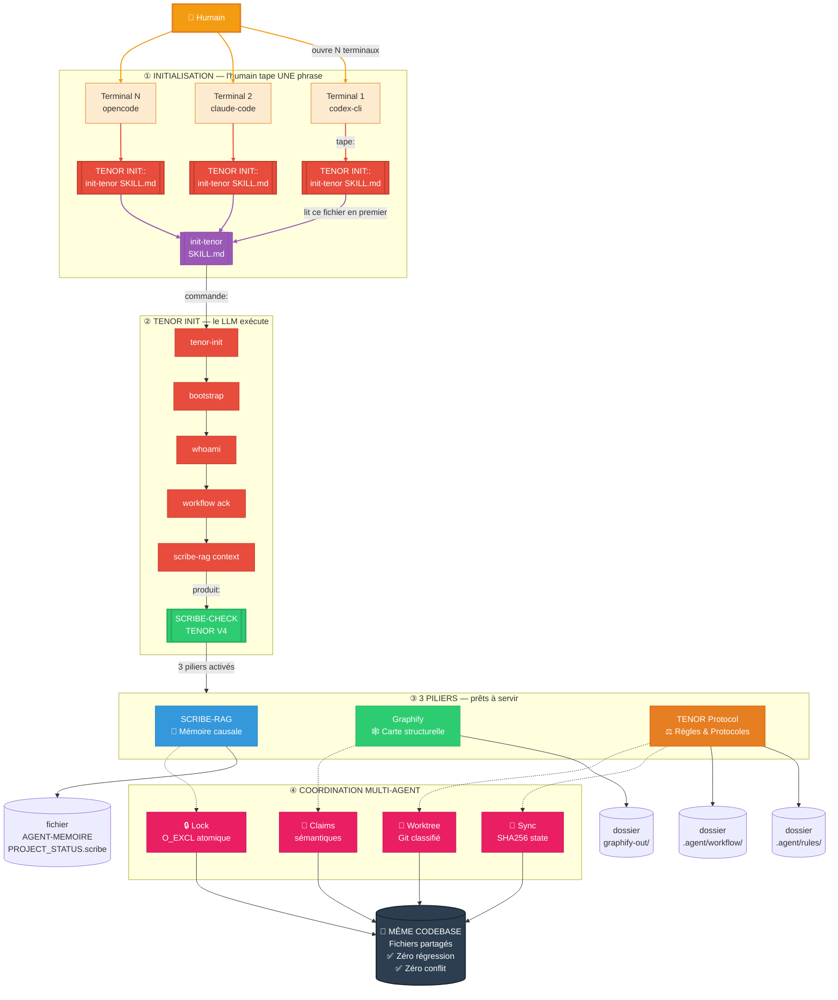

# 🧠 agent-scribe-graphify

<p align="center">
  
  
  
  
  
  
  
</p>

**Bundle portable d'infrastructure agentique**

## 📋 Table des matières

- [✨ Fonctionnalités](#-fonctionnalités)
- [🏗️ Architecture](#️-architecture)
- [⚡ Quick Start](#-quick-start-pour-les-pressés)
- [📦 Installation](#-installation--tutoriel-complet)
- [🚀 Utilisation quotidienne](#-utilisation-quotidienne)
- [👥 Mode Multi-Agent](#-mode-multi-agent)
- [🔄 Portabilité](#-portabilité)
- [🤝 Contribuer](#-contribuer)
- [❓ FAQ / Dépannage](#-faq--dépannage)
- [📄 Licence](#-licence)

**Bundle portable d'infrastructure agentique** — copiez `.agent/` dans n'importe quel projet et bénéficiez instantanément de SCRIBE, Graphify et du protocole TENOR.

> **Un seul dossier. Aucune dépendance externe. Aucune installation globale.**
> Fonctionne avec n'importe quel LLM hôte (OpenCode, Claude Code, Codex, Gemini...).

---

## ✨ Fonctionnalités

| Composant | Rôle |
|:----------|:-----|
| **SCRIBE** | Mémoire causale persistante — pourquoi les décisions ont été prises, les bugs déjà résolus, les patterns à suivre |
| **Graphify** | Carte structurelle du codebase — graphe AST en temps réel, navigation chirurgicale sans lire 50 fichiers |
| **TENOR** | Protocole de fiabilité — 8 règles absolues + 29 protocoles contextuels + self-audit |
| **RAG** | Retrieval-Augmented Generation — interrogez la mémoire projet en langage naturel via BM25 |
| **Multi-agent** | Coordination entre LLM : locks, claims, sync, worktrees |

---

## 🏗️ Architecture

### Arborescence du bundle `.agent/`

```text
.agent/
├── skills/
│   ├── init-tenor/        ← 🔑 PORTE D'ENTRÉE — le SKILL.md que le LLM lit
│   │   └── SKILL.md           au premier appel [TENOR INIT::...]
│   ├── graphify/           ← Compétences Graphify pour l'agent
│   │   └── SKILL.md
│   └── fallow/             ← Compétences auxiliaires
│       └── SKILL.md
│
├── rules/
│   ├── scribe.md           ← Règle always-on : SCRIBE obligatoire
│   └── graphify.md         ← Règle always-on : Graphify avant grepping
│
├── workflow/
│   ├── scribe/             ← 🔧 MOTEUR PRINCIPAL
│   │   ├── scribe          ← CLI maintenance interne (bootstrap, doctor, lock...)
│   │   ├── scribe-rag      ← CLI lecture agent (query, explain, challenge...)
│   │   ├── hooks/          ← Git hooks pré-commit
│   │   ├── sel/            ← Moteur SEL (Python) — documentation, scripts, tests
│   │   ├── rag/            ← Interface RAG BM25 + tests
│   │   └── sel/docs/       ← Documentation protocole complet
│   ├── mcp/
│   │   └── chrome-devtools.md ← Tests navigateur/visuel (MCP)
│   ├── prd/                ← Product Requirements Document
│   └── graphify.md         ← Workflow Graphify
│
└── scripts/                ← Scripts d'automatisation (bootstrap, watch, health)
```

### Diagramme d'ensemble



**Légende** :
| Étape | Qui fait quoi |
|:------|:--------------|
| **①** | 🧑 L'humain ouvre 1, 3 ou 5 terminaux et tape **une seule phrase** dans chacun |
| **②** | 🤖 Chaque LLM lit `init-tenor/SKILL.md` et exécute `tenor-init` → bootstrap → whoami → workflow ack → contexte chargé |
| **③** | ✅ Les **3 piliers** sont activés : SCRIBE (mémoire), Graphify (structure), TENOR (règles) |
| **④** | 🔒 La couche coordination multi-agent protège les écritures concurrentes |
| **📁** | Résultat : tous les LLMs travaillent sur **le même codebase**, sans régression |

### Responsabilités des composants

| Composant | Technologie | Rôle |
|:----------|:------------|:-----|
| **init-tenor** | Markdown (SKILL.md) | 🔑 **Porte d'entrée** — lu en premier par le LLM sur `[TENOR INIT::...]`, déclenche toute l'initialisation |
| **TENOR Protocol** | YAML, Markdown | 8 règles absolues + 29 protocoles contextuels + self-audit + auto-mutation |
| **SCRIBE (SEL)** | Python, YAML | Moteur de mémoire causale : bootstrap, doctor, lock, whoami, workflow, coordination |
| **SCRIBE-RAG** | BM25 + Transformers | Interface de retrieval dual-mode : query, explain, challenge, context, gate, eval |
| **Graphify** | Python, AST | Analyse structurelle temps réel : carte des dépendances, god-nodes, blast radius |
| **Rules** | Markdown | Règles always-on injectées à chaque réponse (`scribe.md`, `graphify.md`) |
| **MCP Chrome** | Markdown | Protocole de test navigateur/visuel (alternative à Playwright) |

### Moteurs de recherche — détail technique

#### 🔧 SEL — Scoring propriétaire à 11 paliers (ni BM25, ni TF-IDF)

Le moteur interne du SCRIBE utilise un **système de scoring cumulatif** défini dans `scribe_search.py` :

| Palier | Condition | Points |
|:-------|:----------|:------|
| 1 | ID exact correspond | +120 |
| 2 | Query dans le titre | +35 |
| 3 | Query dans l'abstract | +18 |
| 4 | Query dans le texte complet | +10 |
| 5 | Tokens chevauchants × min(count, 3) | +3 × overlap |
| 6 | Tokens chevauchants dans le titre | +8 × len |
| 7 | Tokens chevauchants dans l'abstract | +5 × len |
| 8 | Fuzzy match (ratio ≥ 0.86 ou distance ≤ 2) | +6 × min(len, 3) |
| 9 | Fuzzy primaire | +4 × min(len, 3) |
| 10 | Coverage ≥ 50% des tokens query | +4 |
| 11 | Tier "hot" + overlap trouvé | +2 |

**Seuil de pertinence** : score < 6 → résultat éliminé.

**Enrichissement lexical** :
- 52 synonymes manuels (ex: `fiabilite` → reliability, reliable...)
- 5 groupes conceptuels (`context_friction`, `hot_pressure`, `local_retrieval`, `scale_perf`)
- Racine morphologique par suppression de 11 suffixes
- Fuzzy matching : `SequenceMatcher.ratio() ≥ 0.86` OU `edit_distance ≤ 2`

**Index inversé** maison avec 4 types d'arêtes : causal, evidence, consultation, journal.
Construction parallélisée sur 2 workers. Version d'index : `INDEX_VERSION = 3`.

#### ⚡ RAG — BM25 canonique + hybride optionnel

**Mode BM25 (par défaut)** — Formule standard avec :
- `k1 = 1.5`, `b = 0.75`
- IDF : `log(1 + (N - df + 0.5) / (df + 0.5))`
- Score normalisé entre 0 et 1
- 7 groupes de synonymes (auth, storage, cookie, bug, refresh, client, token)
- 27 stopwords

**Mode Hybride** (`--with-embeddings`) — Active le modèle **`all-MiniLM-L6-v2`** (~80 Mo, vecteurs 384 dimensions) via `sentence-transformers` :
- Cosine similarity par dot product normalisé
- Cache modèle : `@lru_cache(maxsize=1)` — chargé une seule fois
- Fallback gracieux si `sentence-transformers` absent

**Fusion pondérée à 8 facteurs** (dans `rag_scoring.py`) :

| Facteur | Poids BM25 (query) | Poids Hybride (query) |
|:--------|:-------------------|:----------------------|
| BM25 | **0.35** | 0.22 |
| Sémantique (cosine) | 0.0 | **0.24** |
| Centralité causale | 0.18 | 0.15 |
| Tier (hot/warm/cold) | 0.13 | 0.10 |
| Qualité evidence | 0.07 | 0.06 |
| Scope match | 0.07 | 0.06 |
| Failure boost | 0.08 | 0.07 |
| Negative (ghosts) | 0.12 | 0.10 |

En mode `challenge`, le poids `negative` monte à **0.35** (BM25) ou **0.32** (hybride) pour bloquer les plans risqués.

**Pipeline de retrieval** :
```
BM25 scores → [Cosine scores si hybride] → Negative matching → Fusion 8 facteurs → Top-5
```

**Gate qualité** : `8/8` checks obligatoires (`≥ 7/8` pour BM25 canonique).

---

#### 🕸️ Graphify — Pipeline en 6 étapes (AST + LLM + NetworkX)

Version installée : **`0.6.2`** (package PyPI `graphifyy`, géré par `pipx`).

```
detect → transcribe → extract (AST + LLM) → build (NetworkX) → cluster + analyze → export
```

| Étape | Méthode | Coût |
|:------|:--------|:-----|
| **detect** | Scan filesystem + classification par extension (25 types de fichiers) | Gratuit |
| **transcribe** | OpenAI Whisper (modèle `base`) pour audio/vidéo | GPU/CPU |
| **extract (AST)** | Parsers syntaxiques natifs — fonctions, classes, imports, variables, signatures | **Gratuit** (déterministe) |
| **extract (sémantique)** | LLM — sous-agents Claude (parallèle, 20-25 fichiers/chunk) ou Kimi K2.6 | Tokens LLM |
| **build** | Construction graphe **NetworkX** (`Graph` ou `DiGraph` si `--directed`) | Gratuit |
| **cluster** | Community detection → détection de **communautés** + score de cohésion | Gratuit |
| **analyze** | **God-nodes** (degré centralité), **connexions surprenantes** (cross-community), questions suggérées | Gratuit |
| **export** | Multi-format : `graph.json`, `graph.html` (interactif), `graph.svg`, `graph.graphml`, `cypher.txt` (Neo4j), vault Obsidian, wiki crawlable | Gratuit |

**Mécanismes clés** :

- **Cache SHA256** : les fichiers non modifiés sont réutilisés entre sessions — pas de re-extraction inutile
- **Watch mode** : surveille le dossier en arrière-plan (debounce 3s) — code modifié → re-extraction AST + rebuild en < 3s
- **Serveur MCP** : expose `query_graph`, `get_node`, `get_neighbors`, `get_community`, `god_nodes`, `graph_stats`, `shortest_path` pour les agents LLM
- **Traqueur de coût** : cumul des tokens consommés dans `graphify-out/cost.json`
- **Hooks durcis** : les hooks Codex/Gemini sont patchés pour consommer `stdin` avant de répondre (via `scribe_graphify_hooks.py`)

**Fichiers de sortie** :
```
graphify-out/
├── GRAPH_REPORT.md      ← Résumé ~500 tokens (god-nodes, communautés, blast radius)
├── graph.json            ← Graphe complet NetworkX (Node-Link)
├── graph.html            ← Visualisation interactive (navigateur)
├── cache/                ← Cache SHA256 des fichiers déjà traités
└── cost.json             ← Coût cumulatif en tokens
```

**Requêtage par l'agent LLM** :
```bash
graphify query "architecture auth"       # BFS traversal (profondeur 3)
graphify query "..." --dfs               # DFS traversal (profondeur 6)
graphify path "FonctionA" "FonctionB"    # Plus court chemin (networkx.shortest_path)
graphify explain "NomModule"             # Explication d'un nœud
graphify update .                        # Mise à jour incrémentale (SHA256 diff)
graphify watch .                         # Watcher arrière-plan temps réel
```

---

#### 🔒 Multi-Agent — Coordination par fichiers (lock atomique + claims sémantiques)

Tout le système de coordination est basé sur le **filesystem** : pas de base de données, pas de daemon, pas de serveur. Chaque agent écrit et lit dans `scribe-out/`.

##### Lock — acquisition atomique (`scribe_lock.py`)

| Propriété | Valeur |
|:----------|:-------|
| Mécanisme | **`O_WRONLY | O_CREAT | O_EXCL`** — création atomique au niveau du noyau |
| Fichier | `scribe-out/locks/scribe.lock` (JSON) |
| TTL par défaut | **30 minutes** |
| Surface par défaut | `scribe-memory` |
| Vérification stale | PID mort (`os.kill(pid, 0)`) OU TTL expiré |

**Règles** :
- **`lock acquire`** refusé si pas de **Workflow ACK** à jour (`ACK_OK` requis)
- **`lock release`** refuse de relâcher le lock d'un **autre agent** (vérifie `agent` + `surface`)
- Stale locks automatiquement nettoyés par `active_lock()`

##### Claims — coordination sémantique (`scribe_coordination.py`)

| Propriété | Valeur |
|:----------|:-------|
| Fichier | `scribe-out/coordination/claims/<claim_id>.json` |
| ID claim | `SHA256(claim)[:12]` — format: `<nom>-<sha256[:12]>` |
| TTL | **1800 secondes** (30 min) |
| Événements | `scribe-out/coordination/events.jsonl` |

**Logique de conflit** :
- **Même claim sémantique** → **REFUS** (return code 2)
- **Fichiers partagés** entre claims différents → **AUTORISÉ** avec warning `shared_files_detected: yes` + obligation de `rebase before delivery`
- Claims sans `expires_at` → traités comme **stale**
- Nettoyage automatique des stale claims à chaque `coordination status`

##### Sync — vérification d'état (`scribe_state.py`)

| Propriété | Valeur |
|:----------|:-------|
| Fichier | `scribe-out/state.json` |
| Écriture | Atomique via `.tmp.<PID>.tmp` → `replace()` |
| SHA256 | Du fichier `AGENT-MEMOIRE_PROJECT_STATUS.scribe` |

**Verdicts** :
- `IN_SYNC` : tout est à jour
- `STALE_HASH` : le SCRIBE a été modifié depuis le dernier sync
- `STALE_STATE_MISSING` : pas de fichier state
- `INVALID_WRITE_KIND` : `write_kind` non reconnu

##### Worktree — classification Git (`scribe_worktree.py`)

Exécute `git status --short --untracked-files=all` et classifie :
1. **tracked_changes** : fichiers suivis modifiés
2. **untracked_source_candidates** : non suivis mais code source (`.py`, `.ts`, `.js`, `.json`, `.md`...)
3. **generated_noise** : exclus (`__pycache__/`, `dist/`, `node_modules/`, `scribe-out/`, `graphify-out/`, `*.pyc`...)
4. **other_untracked** : ni source, ni généré

**Surface Map** (prédéfinie) : `auth`, `websocket`, `frontend`, `tests`, `scribe`, `integration`
**Surface Violation** : si l'agent modifie des fichiers hors de sa surface déclarée → `SURFACE_VIOLATION`

##### Identité / Présence (`scribe_identity.py`)

```python
agent_id = f"{type}-{YYYYMMDD}-{sha256(PID + hostname + time_ns)[:12]}"
```
- Fichier présence : `scribe-out/presence/<agent_id>.json`
- TTL : **120 secondes**
- Heartbeat : mis à jour à chaque `scribe whoami`
- Stale détecté : PID mort OU TTL expiré

##### Workflow ACK (`scribe_workflow_ack.py`)

Calcule un **SHA256** de **10 fichiers** de workflow (AGENTS.md, rules, SKILL.md, docs...).
- `ACK_OK` : tout est à jour
- `ACK_STALE` : les fichiers ont changé depuis le dernier ack
- `ACK_REQUIRED` : l'agent n'a jamais fait `workflow read`

**Verrouillage en chaîne** : impossible d'acquérir un lock sans ACK_OK → impossible d'écrire dans le SCRIBE sans workflow à jour.

##### Séquence type d'un agent avant implémentation

```bash
# 1. Vérifier workflow
scribe workflow check --agent "<ID>"

# 2. Réclamer une zone
scribe coordination claim \
  --agent "<ID>" --claim "auth:login" \
  --task "refacto login" --expected-file "src/auth/login.ts"

# 3. Vérifier lock + sync
scribe lock status
scribe sync --agent "<ID>" --type cli

# 4. Vérifier worktree
scribe worktree --surface auth --agent "<ID>" --limit 80

# 5. [Implémentation...]

# 6. Libérer le claim
scribe coordination finish \
  --agent "<ID>" --claim "auth:login" \
  --summary "refacto terminée" --changed-file "src/auth/login.ts"
```

##### Garanties

| Mécanisme | Garantie |
|:----------|:---------|
| `O_EXCL` | Atomicité au niveau du noyau — pas de race condition sur le lock |
| `SHA256` | Détection de toute modification, même d'un seul octet |
| `PID check` | Lock libéré automatiquement si le processus meurt |
| `TTL` | Claim/libération automatique après 30 min sans heartbeat |
| `Workflow gate` | Pas d'écriture SCRIBE sans avoir relu les règles |
| `Surface violation` | Agent détecté s'il sort de sa zone déclarée |
| `Shared files` | Warn + rebase obligatoire avant livraison |

---

### Cycle de vie complet — quand le LLM écrit ou lit quoi

```text
┌─ PHASE 1 — INITIALISATION (déclenchée par l'humain)
│
│  [TENOR INIT::[.agent/skills/init-tenor/SKILL.md]]
│     ↓
│  Le LLM lit init-tenor/SKILL.md, exécute tenor-init
│     ↓
│  bootstrap → whoami → workflow ack → lock → rag context
│     ↓
│  SCRIBE-CHECK TENOR V4 produit = session prête
│
├─ PHASE 2 — TÂCHE QUOTIDIENNE (humain donne des instructions)
│
│  Vous : "Ajoute une fonction de validation email"
│     ↓
│  Le LLM :
│     1. [CONSULTER] scribe-rag query "validation email déjà faite ?"
│     2. [CONSULTER] graphify query "module auth dépendances"
│     3. [ÉCRIRE]    Implémente le code
│     4. [ÉCRIRE]    Si bug > 2 tentatives → SCAR dans le SCRIBE
│     5. [ÉCRIRE]    Si nouveau pattern → PAT dans le SCRIBE
│
├─ PHASE 3 — CONDITIONS D'ÉCRITURE DANS LE SCRIBE
│
│  Le LLM écrit dans le SCRIBE UNIQUEMENT si :
│     ✅ Bug résolu après PLUS de 2 tentatives → SCAR obligatoire
│     ✅ Régression / rollback coûteux / smoke cassé → SCAR immédiat
│     ✅ Décision architecturale majeure prise → GHOST
│     ✅ Règle préventive identifiée (pour éviter une erreur) → VAC
│
│  Le LLM N'écrit PAS dans le SCRIBE si :
│     ❌ Petite correction routinière (1 tentative, pas de casse)
│     ❌ Aucun bug rencontré
│     ❌ Pour "gonfler" la documentation
│
├─ PHASE 4 — CONDITIONS DE LECTURE / REQUÊTE
│
│  Le LLM CONSULTE le SCRIBE (scribe-rag) :
│     🔍 Avant chaque implémentation → "est-ce que ça a déjà été fait ?"
│     🔍 Avant de modifier un module → "y a-t-il des cicatrices connues ?"
│     🔍 En cas de blocage → "quelles erreurs ont déjà été faites ici ?"
│
│  Le LLM CONSULTE Graphify :
│     🔍 Avant de lire un fichier → "montre-moi la structure"
│     🔍 Avant de modifier → "quel est le blast radius ?"
│     🔍 Pour trouver les dépendances → "qui importe quoi ?"
│
└─ PHASE 5 — FIN DE SESSION
     Le LLM écrit dans le journal de session
     Met à jour les métriques (SCARs, VACs, PATs)
     Propose des mutations de protocole si pertinent
```

---

## 👥 Mode Multi-Agent — plusieurs LLMs, même codebase

Une fonctionnalité clé du bundle : lancer **1, 3, 5 terminaux ou plus** simultanément, chacun avec son propre agent (Codex CLI, Claude Code, OpenCode...), et les faire travailler sur **le même projet, les mêmes fichiers, sans rien casser**.

### Comment ça marche

```text
┌─ TERMINAL 1 ─┐    ┌─ TERMINAL 2 ─┐    ┌─ TERMINAL 3 ─┐
│  OpenCode     │    │  Claude Code  │    │  Codex CLI    │
│  Agent A      │    │  Agent B      │    │  Agent C      │
└──────┬───────┘    └──────┬───────┘    └──────┬───────┘
       │                   │                   │
       └───────────────────┬───────────────────┘
                          ▼
              ┌─────────────────────┐
              │   SCRIBE Lock       │
              │   Coordination      │
              │   Sync & Worktree   │
              └─────────────────────┘
                          │
                          ▼
              ┌─────────────────────┐
              │   MÊME CODEBASE     │
              │   Fichiers partagés │
              │   Zéro régression   │
              └─────────────────────┘
```

### Règles de coordination — chaque agent les respecte

| Situation | Comportement |
|:----------|:-------------|
| **Agent A** travaille sur `auth/login.ts` | Prend un **claim** sur `auth` → les autres agents évitent ce fichier |
| **Agent B** veut modifier `auth/login.ts` | Doit **attendre** ou demander un **rebase** via sync |
| **Agent A** et **Agent B** travaillent sur des fichiers différents | ✅ OK — claims différents, pas de conflit |
| **Agent C** veut écrire dans le SCRIBE | Doit d'abord avoir un **workflow ack** à jour, puis **lock acquire** |
| Avant de livrer | Chaque agent lance `scribe worktree --strict` pour vérifier l'absence de conflit |

### Workflow complet pour l'humain

**1. Ouvrez N terminaux**

```bash
# Terminal 1
cd /chemin/du/projet
# Lancez votre agent (OpenCode, Codex CLI, Claude Code...)

# Terminal 2 (identique)
cd /chemin/du/projet
# Lancez un second agent

# Terminal 3, 4, 5... idem
```

**2. Chaque agent s'initialise**

```text
Vous : [TENOR INIT::[.agent/skills/init-tenor/SKILL.md]]
Agent : 📋 SCRIBE-CHECK TENOR V4 — MACHINE PROOF
        Agent session : cli-20260617-A1
```

Chaque terminal reçoit un **ID unique** (A1, B2, C3...) généré par `scribe whoami`.

**3. Chaque agent prend un claim**

Avant de toucher un fichier, l'agent réserve sa zone :
```bash
.agent/workflow/scribe/scribe coordination claim --scope "auth" --agent "cli-20260617-A1"
```

**4. Synchronisation avant livraison**

```bash
.agent/workflow/scribe/scribe sync --agent "cli-20260617-A1" --type cli
.agent/workflow/scribe/scribe worktree --strict
```

**5. Résultat — zéro conflit, zéro régression**

Les agents :
- **Ne s'écrasent pas** les fichiers mutuellement (claims + locks)
- **Lisert le SCRIBE** avant chaque modification (mémoire des erreurs passées)
- **Consultent Graphify** avant de lire des fichiers (blast radius connu)
- **Synchronisent** avant de livrer (worktree detecte les conflits)

### Pourquoi ça ne casse jamais

| Mécanisme | Protection |
|:----------|:-----------|
| **Claims** | Chaque agent déclare sa zone de travail → les autres savent où il opère |
| **Lock** | Verrouille le SCRIBE pendant une écriture → pas d'écrasement mémoire |
| **Sync** | Synchronise l'état avant chaque action → personne ne travaille sur un état périmé |
| **Worktree** | Vérifie les conflits avant livraison → pas de régression silencieuse |
| **Workflow ACK** | Un agent sans ack frais ne peut pas écrire dans le SCRIBE |
| **Graphify** | Voir le blast radius avant de modifier → éviter les cassures en chaîne |

---

## ⚡ Quick Start (pour les pressés)

```bash
# 1. Copier le bundle dans votre projet
cp -r .agent/ /chemin/vers/mon-projet/

# 2. Initialiser
cd /chemin/vers/mon-projet/
.agent/workflow/scribe/scribe bootstrap

# 3. Dans votre interface agent, tapez :
#    [TENOR INIT::[.agent/skills/init-tenor/SKILL.md]]
#
# 4. Prêt. Donnez des instructions au LLM.
```

> **Temps total : ~30 secondes.** Le LLM fait le reste tout seul.

---

## 📦 Installation — Tutoriel complet

### Prérequis

- **Python 3.10+** avec `pip`
- **Git** (optionnel, pour versionner la mémoire)
- Aucune dépendance globale — tout est dans `.agent/`

### Étape 1 — Copier le bundle

```bash
# Depuis n'importe quel projet hôte :
cp -r /chemin/vers/agent-scribe-graphify/.agent/ /chemin/vers/mon-projet/
```

### Étape 2 — Initialiser le SCRIBE

```bash
cd /chemin/vers/mon-projet/
.agent/workflow/scribe/scribe bootstrap
```

> **⚠️ SÉCURITÉ** : `bootstrap` est **idempotent** — il ne fait que créer ce qui manque. Il ne démande aucun daemon et n'altère pas les fichiers existants.

### Étape 3 — Générer votre identité agent

```bash
.agent/workflow/scribe/scribe whoami --type cli --surface idle
```

Cette commande crée une identité unique pour votre session d'agent.

### Étape 4 — Initialisation complète (TENOR)

```bash
.agent/workflow/scribe/scribe tenor-init --type cli
```

Cette commande remplace les étapes 3 à 8 du protocole TENOR. Elle produit un `SCRIBE-CHECK TENOR V4 — MACHINE PROOF` qui prouve que tout est prêt.

### Étape 5 — Vérification

```bash
# Vérifier que le RAG fonctionne
.agent/workflow/scribe/scribe-rag gate

# Vérifier l'état de santé
.agent/workflow/scribe/scribe doctor

# Explorer le contexte mémoire
.agent/workflow/scribe/scribe-rag context
```

### Résultat attendu

```
gate  : 8/8 ✅
doctor: 0 error ✅
RAG   : BM25 indexé ✅
SCRIBE: prêt à recevoir votre mémoire causale ✅
```

---

## 🚀 Utilisation quotidienne

### Pour l'humain — une seule phrase

Dans votre interface agent (OpenCode, Codex CLI, Claude Code, Cursor, etc.),
tapez simplement cette phrase pour lancer l'initialisation complète :

```text
[TENOR INIT::[.agent/skills/init-tenor/SKILL.md]]
```

**C'est tout.** Le LLM hôte va :
1. Lire le fichier `SKILL.md` pour comprendre le protocole
2. Lancer `tenor-init --type cli` (ou `extension` selon votre interface)
3. Charger le SCRIBE, Graphify, et toutes les règles
4. Produire un `SCRIBE-CHECK TENOR V4 — MACHINE PROOF` pour prouver que tout est prêt
5. Attendre vos instructions d'implémentation

> **Une seule entrée utilisateur. Aucune commande manuelle. Tout est automatisé côté agent.**

#### Exemple de session

```
Vous : [TENOR INIT::[.agent/skills/init-tenor/SKILL.md]]
Agent : 📋 SCRIBE-CHECK TENOR V4 — MACHINE PROOF
        Agent session : cli-20260617-XXXX
        Whoami proof  : OK
        Workflow ack  : ACK_OK
        Status init   : VALID
        ✅ Prêt. Quelle est la prochaine tâche à implémenter ?

Vous : Ajoute une fonction de validation email dans le module auth
Agent : Je consulte le SCRIBE... Graphify analyse le codebase...
        [Travail en cours...]
        ✅ Implémentation terminée.
```

### Pour l'humain — Dashboard (optionnel)

Si vous voulez une interface web pour visualiser l'état du SCRIBE :

```bash
.agent/workflow/scribe/scribe dashboard
.agent/workflow/scribe/scribe dashboard --serve --host 127.0.0.1 --port 8765
```

---

## 🔄 Portabilité — d'un projet à l'autre

Le dossier `.agent/` est **totalement portable** :

```bash
# Projet A → Projet B
cp -r .agent/ /nouveau/projet/

# Dans le nouveau projet :
cd /nouveau/projet/
.agent/workflow/scribe/scribe bootstrap
.agent/workflow/scribe/scribe-rag build
```

> **Note** : La mémoire causale (`AGENT-MEMOIRE_PROJECT_STATUS.scribe`) est propre à chaque projet. Après copie, lancez `bootstrap` pour générer une mémoire vierge adaptée au nouveau contexte.

---

## ⚠️ Sécurité

| Risque | Solution |
|:-------|:---------|
| Email exposé dans le README | Remplacé par `your.email@example.com` |
| Username exposé | Remplacé par `USERNAME` |
| URLs hardcodées | Rendu générique — adaptez à votre contexte |
| Secrets dans le code | Variables d'environnement uniquement |
| Commandes push | Préfixées par `git add` par chemins exacts, jamais `git add .` |

> **⚠️ SÉCURITÉ** : Les commandes `git config user.name` / `git config user.email` sont **locales uniquement**. Remplacez `YOUR_NAME` et `your.email@example.com` par vos informations réelles **avant exécution**. Ne committez jamais le dossier `.agent/` entier — utilisez des chemins exacts.

---

## 🤝 Contribuer

Ce bundle est vivant — il évolue avec les retours du terrain, les besoins réels et les cas d'usage que vous rencontrez.

### Vous pouvez contribuer de plusieurs façons

| Type de contribution | Comment faire |
|:---------------------|:--------------|
| **🐛 Signaler un bug** | Ouvrez une issue sur le repo GitHub avec le comportement observé et attendu |
| **💡 Proposer une évolution** | Décrivez votre use case, ce que le bundle devrait permettre et pourquoi |
| **🔧 Améliorer le code** | Fork, modifiez, et soumettez une Pull Request — scripts Python, règles, documentation |
| **📝 Améliorer la doc** | Une section floue ? Un exemple manquant ? Une typo ? La doc est aussi importante que le code |
| **🧪 Tester** | Testez le bundle sur vos projets et remontez les cas qui cassent |
| **🌍 Partager** | Parlez du bundle autour de vous, plus on est à l'utiliser, plus il s'améliore |

### Esprit du projet

- **Le dossier `.agent/` doit rester portable** — pas de dépendances externes, pas d'installation globale
- **Chaque contribution doit préserver la compatibilité ascendante** — ne pas casser les projets existants
- **La simplicité > la complexité** — une solution simple qui marche vaut mieux qu'une solution élégante qui risque de casser
- **La mémoire causale est sacrée** — ne pas écrire dans le SCRIBE sans raison, ne pas supprimer l'historique

### Cycle de vie d'une contribution

```text
1. Ouvrez une issue   → Discussion sur le besoin ou le bug
2. Fork + branche     → Travaillez sur votre modification
3. Testez             → Vérifiez que SEL (81) et RAG (25) passent
4. Pull Request       → Décrivez ce qui change et pourquoi
5. Review             → Discussion, ajustements si nécessaire
6. Merge              ✅ Contribution acceptée
```

> **Le bundle est MIT — libre, ouvert, construit par et pour la communauté.**

---

## ❓ FAQ / Dépannage

### Q : Le LLM ne lit pas `init-tenor/SKILL.md` en premier

**Cause** : Vous utilisez peut-être une plateforme qui ne lit pas `[TENOR INIT::...]` comme instruction prioritaire.
**Solution** : Assurez-vous que le fichier `.agent/skills/init-tenor/SKILL.md` existe bien. Vous pouvez aussi rappeler au LLM : *"Lis d'abord `.agent/skills/init-tenor/SKILL.md`."*

### Q : `bootstrap` ne fait rien

**Cause** : Le bundle a déjà été initialisé. `bootstrap` est idempotent — il ne fait que créer ce qui manque.
**Solution** : C'est normal. Lancez `scribe doctor` pour vérifier l'état de santé.

### Q : Erreur "command not found: scribe"

**Cause** : Vous n'êtes pas à la racine du projet qui contient `.agent/`.
**Solution** : Vérifiez que vous êtes bien dans le dossier où `.agent/` a été copié. Le chemin canonique est `.agent/workflow/scribe/scribe`.

### Q : Le lock refuse mon lock acquire

**Cause probable** : Votre agent n'a pas fait `workflow read` avant.
**Solution** :
```bash
.agent/workflow/scribe/scribe workflow read --agent "<ID>" --type cli
.agent/workflow/scribe/scribe workflow check --agent "<ID>"
.agent/workflow/scribe/scribe lock acquire --agent "<ID>" --session "<JOURNAL-ID>"
```

### Q : Deux LLMs se marchent dessus sur le même fichier

**Remède** : Chaque agent doit prendre un **claim** avant de travailler :
```bash
.agent/workflow/scribe/scribe coordination claim \
  --agent "<ID>" --claim "ma:zone" \
  --expected-file "src/mon-fichier.ts"
```

### Q : Le SCRIBE a été modifié par un autre agent, mon état est périmé

**Solution** :
```bash
.agent/workflow/scribe/scribe sync --agent "<ID>" --type cli
.agent/workflow/scribe/scribe-rag build --force
.agent/workflow/scribe/scribe-rag context
```

### Q : Graphify ne trouve pas mes fichiers

**Solution** : Vérifiez que `graphify update .` est lancé depuis la racine du projet. Les fichiers dans `.agent/` sont exclus par `.graphifyignore`.

### Q : Les badges ne s'affichent pas sur GitHub

**Solution** : Les badges utilisent `shields.io` — ils fonctionnent sans configuration. Si votre repo est privé, les badges s'affichent quand même.

---

## 📄 Licence

Distribué sous licence **MIT**. Utilisation libre, modification autorisée, attribution requise.

---

## 🙏 Crédits

- **SEL** — Moteur interne SCRIBE (Python, YAML)
- **SCRIBE-RAG** — Interface de retrieval BM25 + FastAPI
- **Graphify** — Analyse AST et visualisation de codebase

---

> Construit avec rigueur pour les équipes qui veulent que leurs LLMs aient de la mémoire.
